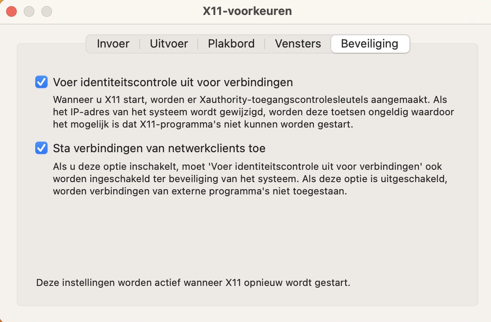

# WEEK 1: FIREWORKS

https://www.coursera.org/learn/effective-scala/programming/MT64m/fireworks/instructions

## Installing Quartz
To get the Fireworks showing up on the host screen, an X11 server should be installed on the Mac. XQuartz can be downloaded here: https://www.xquartz.org

Make sure the security settings look like this (don't forget to restart after changing the settings!):

